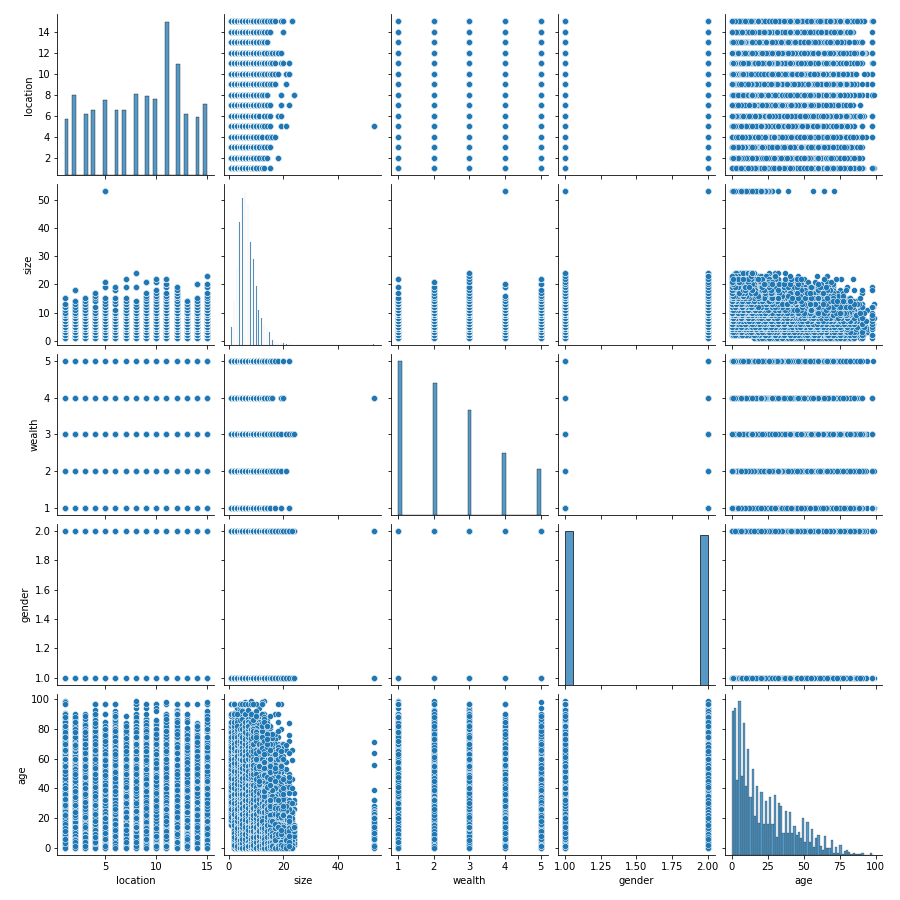

# Liberia: Analyzed
## A deep dive into the analysis of Liberia's Humanitarian Data
This project was performed almost entirely on jupyter-hub as provided access by The College of William and Mary's Data Science Department. 
Python was used to complete these regressions and the following version was run: 
The following pacakges would be required to implement the same analysis as I have: Numpy, Matplotlib as imported from pyplot, pandas, and sklearn
My full script will be provided below for replication purposes, comments will provide as useful guides to the operations I am performing, if you have any questions reach out to me. 
## An Initial Description
### What the data set looks like, where we're going
This data set is a sociopolitical and wealth descriptor set of data surrounding Liberia. It contains six columns of information: location, size, wealth, gender, age, and education. We will be using the former five columns to predict the latter column- education. This can be referred to as the target. 

I produced an initial pairplot, using the Python package seabornplot, to look at the relationships before attempting any classification methods because it is important to do a quick scan of the covariates to detemine if there are any already visible and clear relationships. Since pairplots tend to be quite computationally expensive, to replicate this analysis I would only recommend doing so on a publicly or privately provided compuational network such as William and Mary's Jupyter-Hub. The pairplot is provided below, it demonstrates some strong correlative relationships which indicate that an analysis on this data set will most likely be fruitful. 
#### Image 1: Pairplot of Liberia's Covariates

