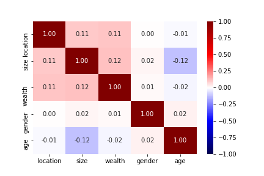
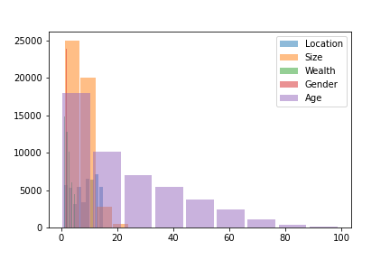
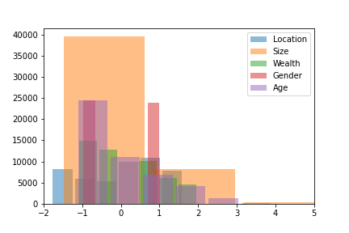
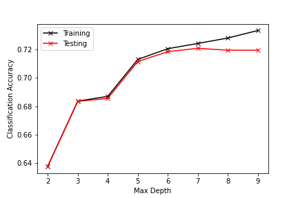

# Liberia: Analyzed
## A deep dive into the analysis of Liberia's Humanitarian Data
This project was performed almost entirely on jupyter-hub as provided access by The College of William and Mary's Data Science Department. 
Python was used to complete these regressions and the following version was run: 
The following pacakges would be required to implement the same analysis as I have: Numpy, Matplotlib as imported from pyplot, pandas, and sklearn
My full script will be provided below for replication purposes, comments will provide as useful guides to the operations I am performing, if you have any questions reach out to me. 
## An Initial Description
### What the data set looks like, where we're going
This data set is a sociopolitical and wealth descriptor set of data surrounding Liberia. It contains six columns of information: location, size, wealth, gender, age, and education. We will be using the former five columns to predict the latter column- education. This can be referred to as the target. 

I produced an initial pairplot, using the Python package seabornplot, to look at the relationships before attempting any classification methods because it is important to do a quick scan of the covariates to detemine if there are any already visible and clear relationships. Since pairplots tend to be quite computationally expensive, to replicate this analysis I would only recommend doing so on a publicly or privately provided compuational network such as William and Mary's Jupyter-Hub. The pairplot is provided below, it demonstrates some strong correlative relationships which indicate that an analysis on this data set will most likely be fruitful. 
#### Image 1: Pairplot of Liberia's Covariates

I also produced an initial heatmap of the data set in order to vizualize possible and existing correlations, simply in a different manner. An important note, on this heatmap the diagonal line sloping downwards and right is not indicative of a strong correlation between two separate covariates. It is simply the heatmap comparing the variable to itself. Other than that, the more intense the color, the stronger the correlation. If the color is red, it signifies a positive correlation. If the color is blue, it signifies a negative correlation. Both of these relationships can be helpful in the ultimate analysis of this dataset.
#### Image 2: Heatmap of Liberia's Covariates

In addition to these, my final method of viewing the data pre-regression was to produce a histogram with all the different covariates layered on to look for any other visible trends. I began, initially, with simply plotting the dataset. I had to modify the number of bins, the width of the bars, the legends, and the opacity of each of the layers to produce a readible plot. 
#### Image 3: Histogram of Liberia's Covariates

This plot, however, was largely overtaken by the existance of the 'age' column which has a strong tendancy to pull the graph right due to the temporal aspect of this particular covariate. To combat this, and to partially visualize what the standardized data which I will be using later in the analysis will look like, I standardized that dataset, and replotted it onto the histogram. I removed an additional outlier to the right at around x = 12 (which is still related to the age's temporal aspect) and adjusted the bins accordingly for a hopefully clearer histogram.
#### Image 4: Scaled Histogram of Liberia's 40 

## Logistic Regression - the initial classifer 
To begin to attempt to classify educaiton through the existance of the other features, I used a logistic regression. Simply running the regression without any changes in the standardization of the data or the hyperparameters of the logistic regression gives us an accuracy of .57025. This is not a bad jumping off point and is highly indicative of the trends seen above in the pre analysis analysis. 
 
### Standard Scaler 
I, again ran the logistic regression, except this time on the standard scaler feature available from the sklearn.preprocessing library. This yielded a slightly better accuracy of .57030. While this is better, it is nowhere near enough of a positive increase in accuracy to deem this form of standardization useful 

### MinMax Scaler 
Once again, I ran the logistic regression on the same data but using the MinMaxScaler feature also available from the sklearn.preprocessing library. This created a worse outpyt of .5701 accuracy therby indicating that I could retire the MinMaxScaler from use for the rest of the analysis on this dataset

### Normalizer 
I ran the logistic regression with a normalizer as well, also available from the sklearn.preprocessing library. This attempt at preprocessing the data yielded an accuracy of .64652, the highest so far by a LOT considering the only aspect of the regression that I changed was the preprocessing. 

### Robust Scaler 
Finally, I tested the logistic regression with a robust scaler and it produced around the same accuracy as the other preprocessing methods. Even though these different scalers provided different accuracies, I still tested all of them for other models because different preprocessing methods function better for different models

## KNN Classification 
As a second attempt to classify this dataset I ran a K nearest neighbors model validation on this dataset with all the scalers mentioned above. To accomplish this I tested a range of K neighbors to find the best fit for the scaled and unscaled dataset. While looping through, I appended the accuracies and found the maximum accuracy for whichever argument of neighbor that was. The best KNN accuracy was .709. This was achieved through using a MinMaxScaler and 40 neighbors. 
### K- Fold Validation 
I ran a K Fold validation on this same instance of the best KNN accuracy, and I got an accuracy of .72293 which is higher than the KNN classification by itself and the highest accuracy I have generated so far

## Decision Tree Classifier 
As a third attempt to classify this dataset I ran a Decision Tree classifier on this dataset with all the preprocessing scalers I have been using. I generally found my models to be more accurate when I modified the max depth. The highest accuracy I got was .72094 on the unscaled dataset with K fold validation of 15 and a max depth of 5. Scaling datasets does not appear to affect decision trees that much (simply because of the binary search-like structure of the tree). I also created a graph of the these max depths and the accuracies to demonstrate which max depth I picked and why. 
#### Image 5: Max Depth Accuracies  
 
 
## Random Forest Regressor 
As a final attempt to classify this dataset, I ran a Random Forest Regression. For the max depth hyper parameter, at the best accuracy I got a depth of 9 and an accuracy of .72
Building upon this, I used the max depth of 7 to test the n_estimators (or the number of bootstrapped trees) in the random forest. The depth of 9 with 300 trees was the most accurate at .7219 which is a little better than just the depth hyperparameter but not my much. Finally, I ran this through a K Fold validation (using the same number of K Folds as I have been throughout this) and got an accuracy of .73082. 

## Conclusion 
This dataset proved to be interesting and with high correlative tendancies especially for a dataset which is not fixed or randomly generated. Real world data, such as this set, is extraordinarily difficult to work with- there are always missing values, incomplete tables, false reports, and complications which lead to regressions and classifications which don't make sense. Data science, and its unequivocable properties of finding complex relationships, is fundamentally built off of this complexity. If data sets were perfect, data science would not be a required field. That being said, this data set was relatively simple to work with. The highest accuracy I could find was in the low to mid seventies, which is fairly accurate for this type of analysis. Ultimately, and moving foreward, I would like to look at the relationship Libera and it's covariates have with its neighbors- both geopolitically and socioeconomically. Do these trends continue across borders? Does legislation impact these trends? If so, how can we use legislation and the resulting political boundaries to better the target (in this instance, education)? A classificatory approach is only the beginning of delving into the positive, negative, and correlative relationships which provide the basis of a useful analysis. 
 
 
 ### Code
 Below is the script I used to produce this analysis. 
 
 <pre><code>import pandas as pd
import numpy as np
import matplotlib.pyplot as plt

def DoKFold(model,X,y,k,random_state=146,scaler=None):
    '''Function will perform K-fold validation and return a list of K training and testing scores, inclduing R^2 as well as MSE.
    
        Inputs:
            model: An sklearn model with defined 'fit' and 'score' methods
            X: An N by p array containing the features of the model.  The N rows are observations, and the p columns are features.
            y: An array of length N containing the target of the model
            k: The number of folds to split the data into for K-fold validation
            random_state: used when splitting the data into the K folds (default=146)
            scaler: An sklearn feature scaler.  If none is passed, no feature scaling will be performed
        Outputs:
            train_scores: A list of length K containing the training scores
            test_scores: A list of length K containing the testing scores
            train_mse: A list of length K containing the MSE on training data
            test_mse: A list of length K containing the MSE on testing data
    '''
    
    from sklearn.model_selection import KFold
    kf = KFold(n_splits=k,shuffle=True,random_state=random_state)
    
    train_scores=[]
    test_scores=[]
    train_mse=[]
    test_mse=[]
    
    for idxTrain, idxTest in kf.split(X):
        Xtrain = X[idxTrain,:]
        Xtest = X[idxTest,:]
        ytrain = y[idxTrain]
        ytest = y[idxTest]
        
        if scaler != None:
            Xtrain = scaler.fit_transform(Xtrain)
            Xtest = scaler.transform(Xtest)
        
        model.fit(Xtrain,ytrain)
        
        train_scores.append(model.score(Xtrain,ytrain))
        test_scores.append(model.score(Xtest,ytest))
        
        # Compute the mean squared errors
        ytrain_pred = model.predict(Xtrain)
        ytest_pred = model.predict(Xtest)
        train_mse.append(np.mean((ytrain-ytrain_pred)**2))
        test_mse.append(np.mean((ytest-ytest_pred)**2))
        
    return train_scores,test_scores,train_mse,test_mse

def CompareClasses(actual, predicted, names=None):
    '''Function returns a confusion matrix, and overall accuracy given:
            Input:  actual - a list of actual classifications
                    predicted - a list of predicted classifications
                    names (optional) - a list of class names
    '''
    import pandas as pd
    accuracy = sum(actual==predicted)/actual.shape[0]
    classes = pd.DataFrame(columns=['Actual','Predicted'])
    classes['Actual'] = actual
    classes['Predicted'] = predicted
    conf_mat = pd.crosstab(classes['Predicted'],classes['Actual'])
    # Relabel the rows/columns if names was provided
    if type(names) != type(None):
        conf_mat.index=y_names
        conf_mat.index.name='Predicted'
        conf_mat.columns=y_names
        conf_mat.columns.name = 'Actual'
    print('Accuracy = ' + format(accuracy, '.6f'))
    return conf_mat, accuracy

#import and separate data 
dataframe = pd.read_csv('lbr_persons.csv')
y = dataframe['education']
X = dataframe.drop(columns = ['education', 'Unnamed: 0'])
X

#pairplot
import seaborn as sns
sns.pairplot(X[['location', 'size', 'wealth', 'gender', 'age']])
plt.savefig('Paiplot.png')

#heatmap
cols=['location', 'size', 'wealth', 'gender', 'age']
corr_matrix=np.corrcoef(X[cols], rowvar=False)
sns.heatmap(corr_matrix, xticklabels=cols, yticklabels=cols, vmin=-1, vmax=1, cmap='seismic', annot=True, fmt='.2f')
plt.savefig('Heatmap.png')

#initial histogram
my_bins = 9
plt.hist(X['location'], label='Location', bins=my_bins, alpha=.5, rwidth=.9)
plt.hist(X['size'], label='Size', bins=my_bins, alpha=.5, rwidth=.9)
plt.hist(X['wealth'], label='Wealth', bins=my_bins, alpha=.5, rwidth=.9)
plt.hist(X['gender'], label='Gender', bins=my_bins, alpha=.5, rwidth=.9)
plt.hist(X['age'], label='Age', bins=my_bins, alpha=.5, rwidth=.9)
plt.legend()
plt.savefig('Unscaled_Histogram.png')

#scaled histogram
from sklearn.preprocessing import StandardScaler as SS
my_bins = 6
ss = SS()
Xscaled = ss.fit_transform(X)
Xscaled_df = pd.DataFrame(Xscaled, columns = cols)
plt.hist(Xscaled_df['location'], label='Location', bins=my_bins, alpha=.5, rwidth=.9)
plt.hist(Xscaled_df['size'], label='Size', bins=my_bins, alpha=.5, rwidth=.9)
plt.hist(Xscaled_df['wealth'], label='Wealth', bins=my_bins, alpha=.5, rwidth=.9)
plt.hist(Xscaled_df['gender'], label='Gender', bins=my_bins, alpha=.5, rwidth=.9)
plt.hist(Xscaled_df['age'], label='Age', bins=my_bins, alpha=.5, rwidth=.9)
plt.xlim(-2, 5)
plt.legend()
plt.savefig('Scaled_Histogram.png')

#logistic regression

from sklearn.model_selection import train_test_split as tts
from sklearn.linear_model import LogisticRegression as LR

Xtrain,Xtest,ytrain,ytest = tts(X,y,test_size=0.4, random_state=146)
# Fit the model
log_reg= LR(max_iter = 2000)
log_reg.fit(Xtrain,ytrain)
# Predict y for the test set
y_pred = log_reg.predict(Xtest)
# Look at the confusion matrix
CompareClasses(ytest,y_pred)

# Standardize the data
    #standard scaler
from sklearn.preprocessing import StandardScaler as SS
Xtrain,Xtest,ytrain,ytest = tts(X,y,test_size=0.4, random_state=146)
ss = SS()
Xtrain = ss.fit_transform(Xtrain)
Xtest = ss.transform(Xtest)
log_reg= LR(max_iter = 2000)
log_reg.fit(Xtrain,ytrain)
y_pred = log_reg.predict(Xtest)
CompareClasses(ytest,y_pred)

#minmax
from sklearn.preprocessing import MinMaxScaler as mms
minmax= mms()
Xtrain,Xtest,ytrain,ytest = tts(X,y,test_size=0.4, random_state=146)
Xtrain = minmax.fit_transform(Xtrain)
Xtest = minmax.transform(Xtest)
log_reg= LR(max_iter = 2000)
log_reg.fit(Xtrain,ytrain)
y_pred = log_reg.predict(Xtest)
CompareClasses(ytest,y_pred)

#normalizer
from sklearn.preprocessing import Normalizer as NM
nm = NM()
Xtrain,Xtest,ytrain,ytest = tts(X,y,test_size=0.4, random_state=146)
Xtrain = nm.fit_transform(Xtrain)
Xtest = nm.transform(Xtest)
log_reg= LR(max_iter = 2000)
log_reg.fit(Xtrain,ytrain)
y_pred = log_reg.predict(Xtest)
CompareClasses(ytest,y_pred)

#robust scaler
from sklearn.preprocessing import RobustScaler as RS
rs = RS()
Xtrain,Xtest,ytrain,ytest = tts(X,y,test_size=0.4, random_state=146)
Xtrain = rs.fit_transform(Xtrain)
Xtest = rs.transform(Xtest)
log_reg= LR(max_iter = 2000)
log_reg.fit(Xtrain,ytrain)
y_pred = log_reg.predict(Xtest)
CompareClasses(ytest,y_pred)

from sklearn.neighbors import KNeighborsClassifier as KNN
#KNN model
k_range = np.arange(1,50,1) 
# Keep track of the overall accuracy on both training and testing data
train=[]
test=[]
acc = []
Xtrain,Xtest,ytrain,ytest = tts(X,y,test_size=0.4, random_state=146)
for k in k_range:
    knn = KNN(n_neighbors = k)
    knn.fit(Xtrain,ytrain)
    y_pred = knn.predict(Xtest)
    acc.append(CompareClasses(ytest,y_pred)[1])
max(acc)
np.argmax(acc)

#knn with standard scaler
Xtrain,Xtest,ytrain,ytest = tts(X,y,test_size=0.4, random_state=146)
ss = SS()
Xtrain = ss.fit_transform(Xtrain)
Xtest = ss.transform(Xtest)
k_range = np.arange(1,50,1)
train=[]
test=[]
acc = []
for k in k_range:
    knn = KNN(n_neighbors = k)
    knn.fit(Xtrain,ytrain)
    y_pred = knn.predict(Xtest)
    acc.append(CompareClasses(ytest,y_pred)[1])
max(acc)
np.argmax(acc)

#knn with minmax
minmax= mms()
Xtrain,Xtest,ytrain,ytest = tts(X,y,test_size=0.4, random_state=146)
Xtrain = minmax.fit_transform(Xtrain)
Xtest = minmax.transform(Xtest)
k_range = np.arange(1,50,1)
train=[]
test=[]
acc = []
for k in k_range:
    knn = KNN(n_neighbors = k)
    knn.fit(Xtrain,ytrain)
    y_pred = knn.predict(Xtest)
    acc.append(CompareClasses(ytest,y_pred)[1])
print(max(acc))
print(np.argmax(acc))
#0.709301119867275, 40

#Kfold on above
knn = KNN(n_neighbors = 40)
tr,te,_,_ = DoKFold(knn,X.values,y,k=10, scaler = mms())
print(max(te))

#knn with normalizer 
nm = NM()
Xtrain,Xtest,ytrain,ytest = tts(X,y,test_size=0.4, random_state=146)
Xtrain = nm.fit_transform(Xtrain)
Xtest = nm.transform(Xtest)
k_range = np.arange(1,50,1) 
train=[]
test=[]
acc = []
for k in k_range:
    knn = KNN(n_neighbors = k)
    knn.fit(Xtrain,ytrain)
    y_pred = knn.predict(Xtest)
    acc.append(CompareClasses(ytest,y_pred)[1])
print(max(acc))
print(np.argmax(acc))

#knn with robust scaler
rs = RS()
Xtrain,Xtest,ytrain,ytest = tts(X,y,test_size=0.4, random_state=146)
Xtrain = rs.fit_transform(Xtrain)
Xtest = rs.transform(Xtest)
k_range = np.arange(1,50,1) 
acc = []
for k in k_range:
    knn = KNN(n_neighbors = k)
    knn.fit(Xtrain,ytrain)
    y_pred = knn.predict(Xtest)
    acc.append(CompareClasses(ytest,y_pred)[1])
print(max(acc))
print(np.argmax(acc))

#Decision Tree
from sklearn.tree import DecisionTreeClassifier as DTC
from sklearn import tree

Xtrain,Xtest,ytrain,ytest = tts(X, y, test_size=0.4, random_state=146)
dtc = DTC(random_state=146, max_depth = 50, min_samples_split = 10)
dtc.fit(Xtrain,ytrain)
y_pred = dtc.predict(Xtest)
CompareClasses(ytest,y_pred)

d_range = np.arange(2,10)
k=15
train = []
test = []

for d in d_range:
    dtc = DTC(random_state=146, max_depth = d)
    tr,te,_,_ = DoKFold(dtc,X.values,y,k)
    train.append(np.mean(tr))
    test.append(np.mean(te))
max(test) #.72094

#plot for max depth
plt.plot(d_range, train, '-xk', label='Training')
plt.plot(d_range, test, '-xr', label='Testing')
plt.xlabel('Max Depth')
plt.ylabel('Classification Accuracy')
plt.legend()
plt.savefig('Max_depth.png')

#random forest classifer
from sklearn.ensemble import RandomForestClassifier as RFC

#random forest 
min_split = np.arange(2, 20)
max_depth = np.arange(2, 20)
n_est = [50,100,200,300,400,500]
acc = [] 
for k in max_depth: 
    for j in n_est: 
        Xtrain,Xtest,ytrain,ytest = tts(X,y,test_size=0.4, random_state=146)
        rfc = RFC(random_state=146, max_depth = k, n_estimators = j)
        rfc.fit(Xtrain,ytrain)
        y_pred = rfc.predict(Xtest)
        acc.append(CompareClasses(ytest,y_pred)[1])

print(max(acc))
print(np.argmax(acc))

rfc = RFC(max_depth = 9, n_estimators = 300)
tr,te,_,_ = DoKFold(rfc,X.values,y,k=10)
print(max(te))
#0.7308170883450851

</code></pre>

